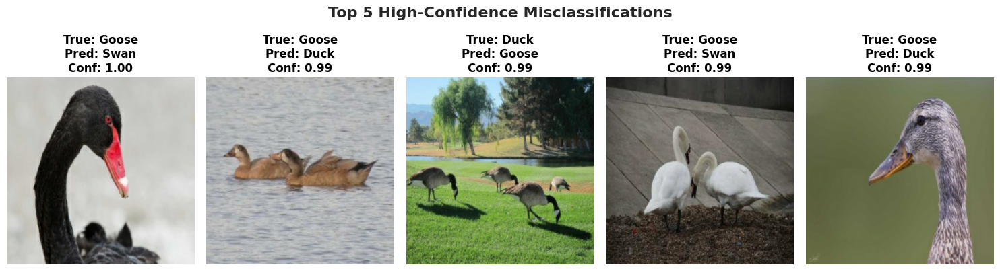
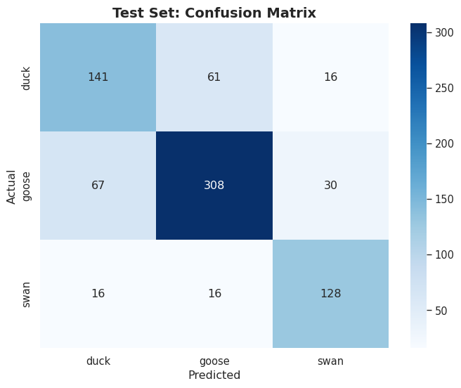
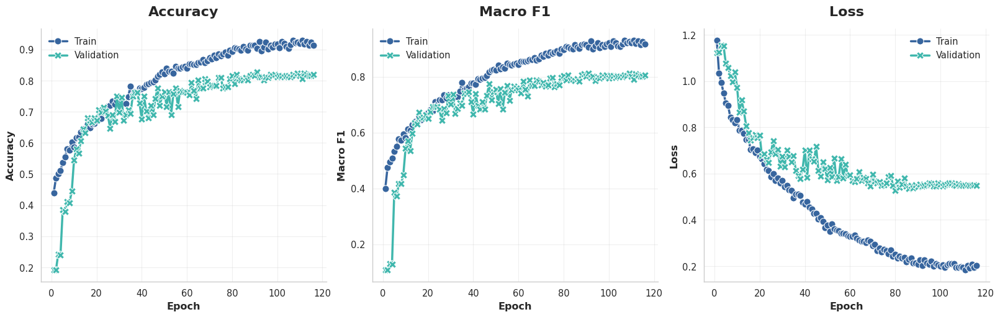

# Waterfowl Multiclass Classification (CNN)

A deep learning project built to classify colour (RGB) images of ducks, geese, and swans from a heavily constrained and imbalanced dataset (~1814 training images, 783 test images). 

## Overview & Results
This repository contains a Convolutional Neural Network (CNN) built from scratch using TensorFlow/Keras, optimised via Bayesian Optimisation (Keras Tuner), and regularised to prevent overfitting on small-scale ecological data.

*   **Baseline (Zero-Rule):** 54.1% (majority class prediction)
*   **Validation Accuracy:** ~83% (Macro F1: 0.81)
*   **Test Accuracy:** ~74%

---

## Model Evolution

The model architecture was iteratively refined through systematic experimentation:

1.  **Eliminating the Flatten Bottleneck:** Swapped out a traditional, memory-heavy `Flatten()` layer for a branching **Global Average Pooling + Global MaxPooling** classifier head. This cut the model parameters by >99% and shrank the saved model footprint from ~230 MB down to a lightweight **1.98 MB**.
2.  **Robust Regularisation:** Integrated Batch Normalisation, Spatial Dropout on deeper convolutional blocks, and targeted data augmentation to manage generalisation on a small sample size.
3.  **Bayesian Hyperparameter Tuning:** Used Keras Tuner to systematically discover optimal learning rates ($3.6 \times 10^{-4}$), label smoothing (0.5%), and regularisation strengths.

---

## Notable Results

During qualitative evaluation of high-confidence errors, the model frequently outputted 100% confidence predictions that contradicted the test set's ground-truth labels. 

*   *Example:* The model correctly identified a black swan (with a distinctive red bill) as a **Swan** with 100% confidence, despite the test set recording it as a **Goose**. 
*   *Example:* Several mallards and Canada geese were mislabelled in the original test archive, but correctly caught by the network.

This proves that the network learned robust, invariant biological features (such as beak structure and neck profiles) rather than relying on simple color heuristics. Consequently, the **74% test accuracy is a severe underestimation** of the model's true capability, as it was penalised for overriding human annotation errors.

### Test Set Confusion Matrix

### Training and Validation Curves

---
